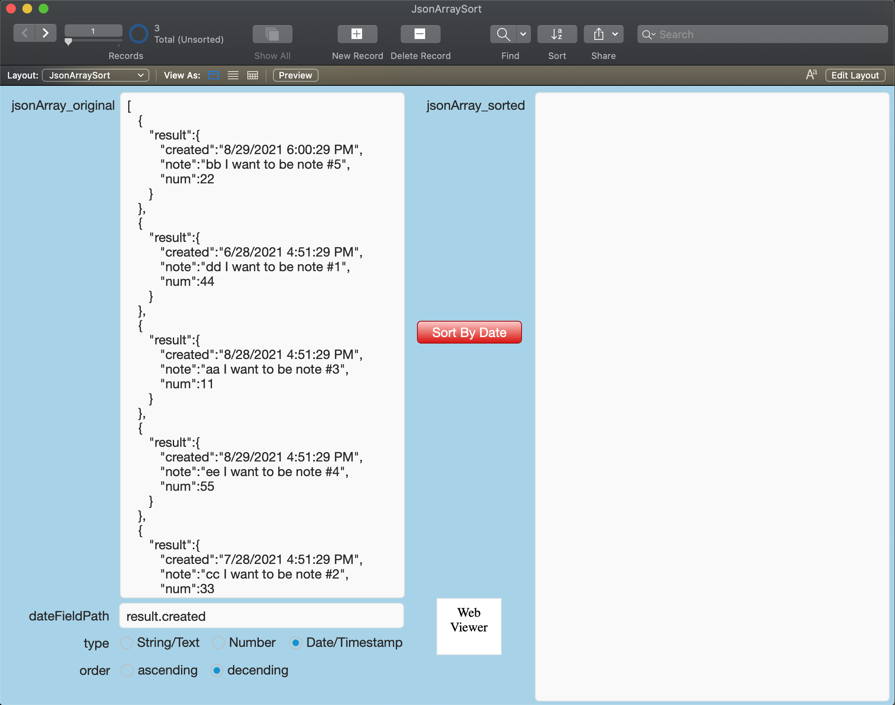
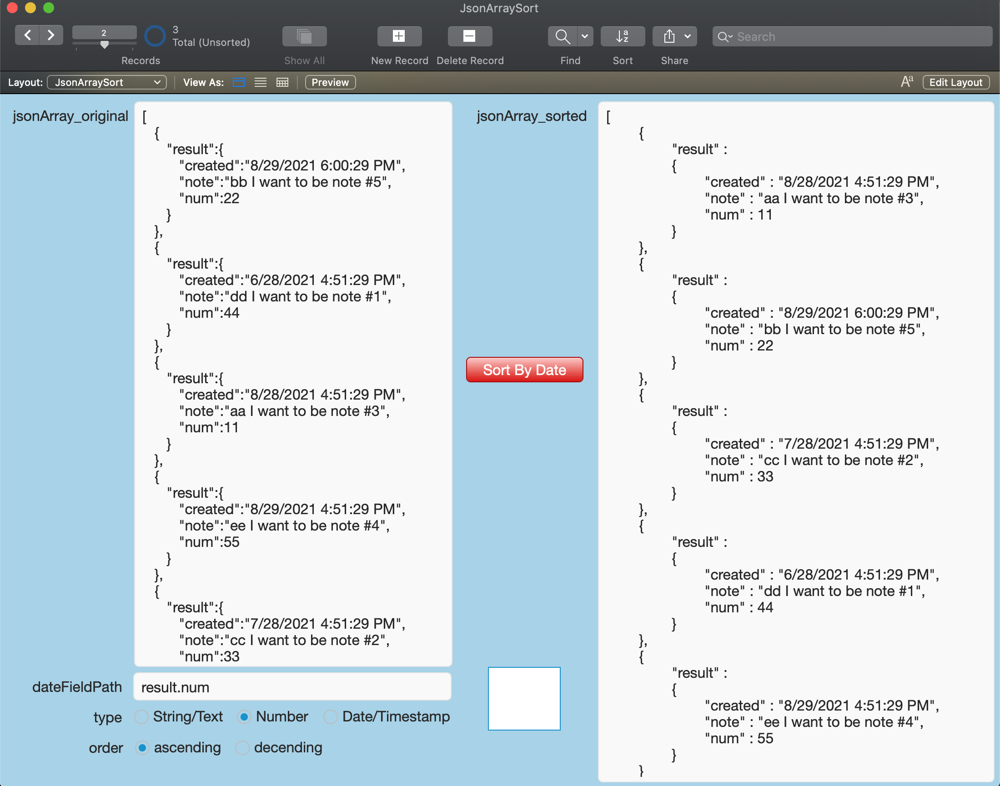

# JsonArraySort

#### A FileMaker Pro Add-On

Quickly sort a JSON Array by any element (date, number, string/text)

#### Points To Ponder

If you use an API to communicate with an external vendor or client in your FileMaker solution, you can use this tool to pre-sort the Json results before processing them in FileMaker Pro.

You could use the native FileMaker (v19.0 or newer) function "Execute FileMaker Data API" to query the database for a set of records, and using this tool, sort the JSON results by any field/element before continuing your FileMaker process flow.

Sorting these JSON objects will be much faster using this tool, versus writing a FileMaker Script to loop thru imported JSON objects and then sort them in FileMaker Pro.

#### Installation

1. Download "JsonArraySort.fmaddon"

2. Double-click the downloaded file to open FileMaker Pro and it will be automatically installed into the correct directory

3. Open or create the database you wish to add "JsonArraySort" to

4. Create a new, empty "Form" layout

5. In Layout mode, make sure that you have the left side "Objects" pane visible, and click on the "Add-ons" tab

6. Click on the Add "+" button (lower right of pane)

7. Scroll thru the list of possible Add-Ons and select "JsonArraySort" and click "Choose" button

8. Drag newly added Add-On icon over into the layout body

9. Add-On has now been installed, adding the following:
  * 2 new Scripts: "JsonArraySort ( theJsonArray ; dateFieldPath ; order )" & "JS_Result_Handler ( results )"
  * "JsonArraySort" Table with 10 Fields and 3 Records
  * 1 new Layout: "JsonArraySort"

10. Navigate to the new layout "JsonArraySort"

#### Usage

1. Observe the provided Json array on the left, or replace with your own Json array

2. Click on the provided button "Sort By Date" to run the sort

3. The results will be returned in 2 ways:
  * JsonArray_sorted field on the right
  * Global variable "$$JS.JSON_ARRAY_SORT.RESULTS"

#### Dependancies

None
